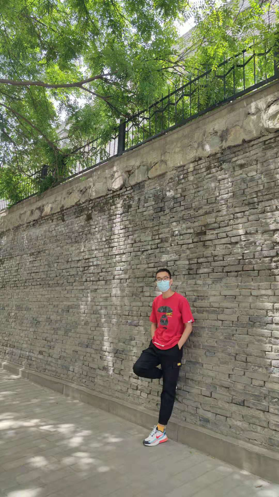

## Personal Page

<table border="0">
  <tr>
    <td width="60%">
      <h1>Xuan Chen</h1>
      
<b>A graduate student of AFEU.</b>

      
<b>Tel: 18142487964</b>

      
<b>Email: chenxuan0839@gmail.com</b>

      
<b>Github:<a href="https://github.com/928082786">
      https://github.com/928082786</a></b> 

      
<b>Address:  Baqiao, Xi'an City, Shaanxi Province</b>

    </td>
    <td width="40%">
          
    </td>
  </tr>
</table>

I am a graduate student of AFEU. 
My primary interests are deep learning, adversarial attacks, and backdoor attacks. 
Besides, the researches of quantum computing and quantum machine learning also attract me much.

### The recently research
1. Boundary augment: A data augment method to defend poison attack
:rocket: [Paper](https://ietresearch.onlinelibrary.wiley.com/doi/full/10.1049/ipr2.12325)

2. Use Procedural Noise to Achieve Backdoor Attack
:rocket: [Paper](https://www.researchgate.net/publication/354345187_Use_Procedural_Noise_to_Achieve_Backdoor_Attack)

### Activity
